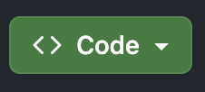

# DiscordJS V14 Bot Template - TypeScript
 A template for TypeScript Discord bots, made by @benjisqt
 **Based on the [Stylar-TS](https://github.com/StylarBot/Stylar-TS) handler**

# Instructions Index
**[Downloading](https://github.com/benjisqt/discordts-template-v14#downloading)**

# Downloading
*Make sure you have [Node.JS](https://nodejs.org) installed before you continue.*

- Download code **or** use Git:
>  
To download the code straight from the repository, press this button. 

> To clone from the repository to your computer using **Git**, run the following command in your Terminal/Command Prompt: 
`git clone https://github.com/benjisqt/discordts-template-v14` 
And wait for the process to complete!

# Obtaining a "Bot Token"
*Obtaining a bot token for your bot is relatively easy.*
- Go to the [Discord Developer Portal](https://discord.com/developers/applications) and make a new application. The screen should look something like presented below:

- Enter a name for your application, tick the box below and click `Create`!
- In the side panel (shown below):

Click `Bot`, you should have a screen that looks like this:

Scroll down and enable all of the following settings:

`Presence Intent` 
`Server Members Intent` 
`Message Content Intent` 

Your Privileged Gateway Intents page should now look like this:

Now scroll back up, click the `Reset Token` button:

Then press `Copy Token` once reset. 
**NOTE: Resetting the bot's token may require you to enter a 2FA code. This is completely normal.** 

# Running the bot!
*An IDE is recommended for this step. Examples of IDEs:  `Visual Studio Code`, `Atom` *
It just makes the process easier!

- In the template directory, rename `config.example.json` to `config.json`.
- Go into the config.json file and enter your bot token in the "token" field.

**NOTE: The "guildId" property does NOT need to be filled in unless you are assigning the bot's commands to a specific server. If not, leave this blank and the bot will automatically assign the commands globally (any server with the bot can use the commands).**

In your Terminal/Command Prompt (in the template directory), run the following commands: 

`npm install` 
`npm run nodemon` 

**NOTE: On macOS systems, you may need to use `sudo npm install` as opposed to `npm install`. This is because macOS uses file protection on the .npm directory, which may not let you install NPM packages without using sudo. Sudo does require your password, which is a standard system process.** 

*Any issues? Contact me on Discord: @benjisqt*